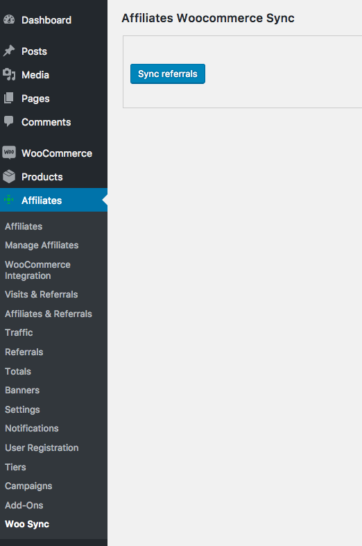

# affiliates-woo-sync
Synchronize the status of the old referrals according to the status of the orders.
Useful if you were using Affiliates and now you are going to use Affiliates Pro, to synchronize the old referrals. It requires Affiliates Pro or Affiliates Enterprise.

'Rejected' and 'Closed' referrals will not be synchronized.

It is highly recommended to make a backup before executing the script.

## Screenshot
